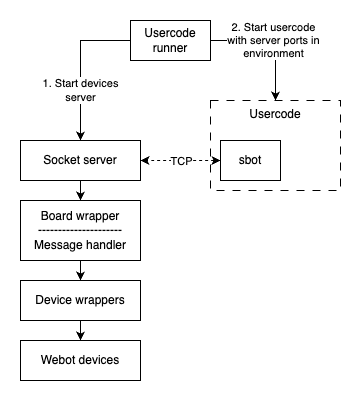
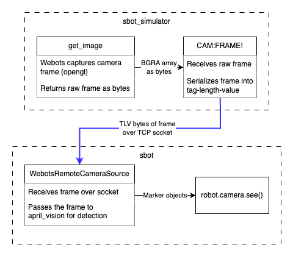

# sbot_simulator
A simulator built around Webots to use the sbot library virtually


### This is a work in progress

## Installation

First, you need to install Webots. You can download the latest version from the [Webots website](https://cyberbotics.com/#download).
After cloning the repository, you can install the simulator using the setup script.
```bash
./scripts/setup.py
```
This script will create a virtual environment, install the required dependencies and set up Webots to use this virtual environment.
Alternatively, you can install the simulator manually by following the steps below.
```bash
python3 -m venv venv
source venv/bin/activate
pip install -r requirements.txt
```
You will also need to set the Python paramter in the Webots preferences to point at the python binary in the virtual environment.

If you are intending to develop the API components of the simulator, you can install the sbot library in development mode as this is where the competitor facing API is defined.
```bash
git clone https://github.com/sourcebots/sbot.git
pip install -e ../sbot
```

## Development

When debugging the simulator, you can use the `WEBOTS_DEVICE_LOGGING` environment variable to set the logging level of the devices in the simulator.
By default, this is set to `WARNING`, setting it to `INFO` will log most device interactions and setting it to `DEBUG` will log all socket communication.
This can be achieved using the [runtime.ini file](https://cyberbotics.com/doc/guide/controller-programming#environment-variables) in Webots.

- linting/typing
To run the CI checks locally, you can install the development requirements and run the check commands.
```bash
pip install -r dev_requirements.txt
poe lint
poe type
```

Linting errors can also be observed in real-time using the vscode extension charliermarsh.ruff after installing the development requirements.

__FUTURE FEATURE__

Unit and integration tests are grouped into two categories: those that don't require Webots and those that do.
The former can be run using the `poe test` command, while the latter can be run using the `poe webots-test` command.

### Releases

- tags
- release script (run by CI)
```bash
# If you installed dev_requirements.txt
poe release
# Else
./scripts/generate_release.py
```

## How it works

- sbot interface
    - 
    - WEBOTS_ROBOT - device urls
    - WEBOTS_SIMULATOR == 1 - simulator running
    - SBOT_METADATA_PATH
- vision
    - 
- world design
    - base arena
    - markers
    - rebot design
        - bounding box
        - shadows

## Project Structure

- separate test world
- main world project under simulator folder
- simplified project output for releases

## Project Status

1. ~~device spinup~~
2. ~~debug logs~~
3. ~~test devices~~
4. ~~webots devices~~
5. ~~usercode runner~~
6. ~~vision~~
7. ~~arena~~
    - ~~box~~
    - ~~deck~~
    - ~~triangle deck~~
    - ~~floor texture~~
        - ~~line~~
        - ~~scoring lines~~
        - ~~starting zones~~
8. ~~robot~~
9. ~~device jitter~~
    - ~~in Webots~~
        - ~~Ultrasound noise~~
        - ~~Reflectance sensor noise~~
    - ~~in python~~
        - ~~motor noise~~
        - ~~servo noise~~
10. sbot updates
    1. ~~simulator discovery~~
    2. ~~vision~~
    3. leds
    4. ~~sleep & time~~
    5. Windows startup performance
11. ~~keyboard robot~~
12. ~~setup script~~
13. ~~releases~~
14. documentation
    1. dev setup
    2. user usage
    3. how it works
15. simulator tests
    - vision position
    - vision orientation
    - distance sensor
    - reflectance sensor
    - bump sensor
    - motor
    - servo
16. ~~linting~~
17. ~~CI~~
18. report currents
19. supervisor
20. comp match running
